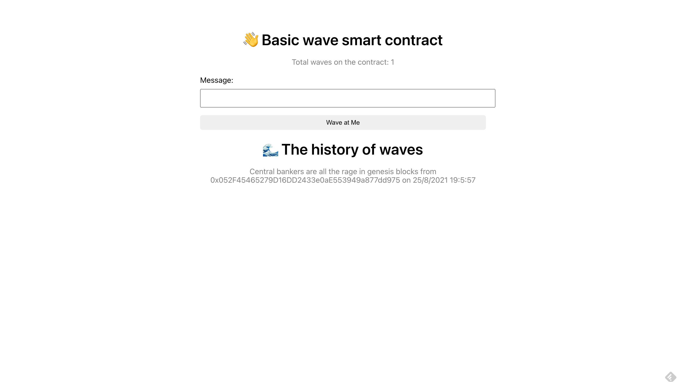

# UI For Ethereum Web 3.0 App

The website to interact with an Ethereum blockchain application, built with Solidity smart contracts.

[View the app here](https://timkellytk.github.io/web3-app-solidity-ui/)

The blockchain application is deployed on the Rinkeby Ethereum test blockchain network. You can view the Solidity smart contract code at this [Github repo](https://github.com/timkellytk/web3-app-solidity).

To play with the application:

- Set up a [MetaMask](https://metamask.io/) wallet
- Get free Ethereum from the [Rinkeby Faucet](https://faucet.rinkeby.io/)
- Write a message and wave

Inspired by a [BuildSpace](https://buildspace.so/) tutorial.
